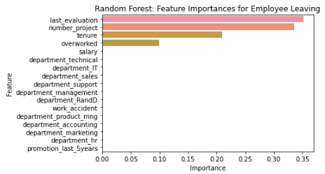

# Saliford Motors Employee Retention Project

## Project Title
Modeling Employee Retention Using Logistic Regression and Tree-Based Models

## Project Overview
The objective of this project is to perform exploratory data analysis (EDA) on employee data provided by the HR department and develop binary classification models (Logistic Regression, Decision Trees, Random Forest, and XGBoost) to predict whether an employee will stay or leave Saliford Motors. The final Random Forest model achieved a 96% accuracy, 92% F1-score, and 0.942 ROC-AUC, successfully identifying key factors influencing employee retention. The most significant factors identified were the employee’s last evaluation score, the number of projects they worked on, their tenure, and whether they were overworked.

## Business Understanding
Hiring, interviewing, and training new employees is both costly and time-intensive. Understanding the factors contributing to employee attrition is crucial for providing data-driven recommendations to improve retention at Saliford Motors, ensuring long-term cost savings and a more stable workforce.

## Data Understanding
The employee dataset, sourced from [Kaggle HR Job Prediction](https://www.kaggle.com/datasets/mfaisalqureshi/hr-analytics-and-job-prediction?select=HR_comma_sep.csv), contains records for 14,999 employees with 9 features and 1 outcome variable. These features include average monthly hours worked, years spent at the company, salary level, last evaluation score, number of projects completed, and promotion status within the last 5 years. A total of 3,008 duplicate records were removed, leaving 11,991 unique employees. Of these, approximately 83% are current employees, while 17% have left the company. Categorical features such as salary and department were ordinally encoded and converted into dummy variables for the regression model. The satisfaction feature was dropped due to potential data leakage concerns. Additionally, a new feature, "overworked," was engineered based on average monthly hours worked, to capture whether employees were being overworked.

## [Python Workbook](https://github.com/roenseed/Saliford-Motors-Project/blob/main/Salifort_Lab.md)

## Modeling and Evaluation
The final Random Forest model, consisting of 300 trees, was selected as the best model to predict employee retention. The model also helped identify key predictive features. The plot below shows that the last evaluation score, number of projects completed, tenure, and whether the employee was overworked were the most important predictors for employee retention. The model achieved an accuracy of 96%, an F1-score of 92%, and an ROC-AUC of 0.942 on the test set.

## Conclusion
The Random Forest model was retrained on the full dataset (training, validation, and test sets combined) to prepare for potential future deployment. The EDA and model results confirmed that overwork was a major factor in employee attrition. Based on these insights, several recommendations were made to stakeholders, including limiting the number of projects per employee, improving work-life balance, and reviewing time-off policies to enhance employee retention.
